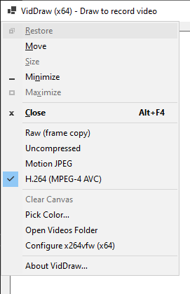

<!--
  Copyright (c) 2021 Eliah Kagan

  Permission to use, copy, modify, and/or distribute this software for any
  purpose with or without fee is hereby granted.

  THE SOFTWARE IS PROVIDED "AS IS" AND THE AUTHOR DISCLAIMS ALL WARRANTIES WITH
  REGARD TO THIS SOFTWARE INCLUDING ALL IMPLIED WARRANTIES OF MERCHANTABILITY
  AND FITNESS. IN NO EVENT SHALL THE AUTHOR BE LIABLE FOR ANY SPECIAL, DIRECT,
  INDIRECT, OR CONSEQUENTIAL DAMAGES OR ANY DAMAGES WHATSOEVER RESULTING FROM
  LOSS OF USE, DATA OR PROFITS, WHETHER IN AN ACTION OF CONTRACT, NEGLIGENCE OR
  OTHER TORTIOUS ACTION, ARISING OUT OF OR IN CONNECTION WITH THE USE OR
  PERFORMANCE OF THIS SOFTWARE.
-->

# VidDraw - record video as you draw

*Written in 2021 by Eliah Kagan &lt;degeneracypressure<!-- -->@gmail.com&gt;.*

**Vid&shy;Draw** is a Windows program that records a video of a canvas as you
draw on it. Recording starts when you begin drawing and stops when you&rsquo;re
no longer holding down any mouse buttons.

The main goal of Vid&shy;Draw is to demonstrate using
[Sharp&shy;Avi](https://github.com/baSSiLL/SharpAvi) (which wraps
[VfW](https://docs.microsoft.com/en-us/windows/win32/api/vfw/)) to record a
canvas, [toast
notifications](https://docs.microsoft.com/en-us/windows/uwp/design/shell/tiles-and-notifications/send-local-toast?tabs=uwp),
and [embedded
browsing](https://docs.microsoft.com/en-us/dotnet/api/system.windows.forms.webbrowser?view=net-5.0).
It began as a prototype for the video-recording feature of a larger program
I&rsquo;ve been working on. It&rsquo;s also kind of a fun toy.

This is **Vid&shy;Draw alpha <del>1</del>&thinsp;<ins>0</ins>**. It still has
[some usability bugs](#known-bugs).

## License

Vid&shy;Draw is [free software](https://en.wikipedia.org/wiki/Free_software).
Its own code [is licensed](COPYING.0BSD) under
[0BSD](https://spdx.org/licenses/0BSD.html) (&ldquo;Zero-Clause BSD
License,&rdquo; also known as the [Free Public License
1.0.0](https://opensource.org/licenses/0BSD)), which is a [&ldquo;public domain
equivalent&rdquo;](https://en.wikipedia.org/wiki/Public-domain-equivalent_license)
license. Vid&shy;Draw&rsquo;s dependencies are also free, but they are offered
under other licenses. See [Dependencies](#dependencies) below for details.

Since some of Vid&shy;Draw&rsquo;s dependencies are included directly in this
repository, some of the files in this repository have other authors and are
licensed under terms other than 0BSD. See [`LICENSE`](LICENSE) and
[Notices](#notices).

## Setup

This alpha version of Vid&shy;Draw doesn&rsquo;t have binary downloads, so it
must be built from source. You&rsquo;ll need the [.NET
5](https://dotnet.microsoft.com/download/dotnet/5.0) SDK. To clone the
repository and build Vid&shy;Draw, run:

```powershell
git clone https://github.com/EliahKagan/VidDraw.git
cd VidDraw
dotnet build
```

Then, to run the program:

```powershell
dotnet run
```

Those commands build and run a &ldquo;debug&rdquo; build. If you want a
&ldquo;release&rdquo; build instead, use `dotnet build -c Release` and
`dotnet run -c Release`.

Dependencies not included in this repository will be [downloaded
automatically](https://www.nuget.org/). Running [`dotnet
run`](https://docs.microsoft.com/en-us/dotnet/core/tools/dotnet-run) without
first running [`dotnet
build`](https://docs.microsoft.com/en-us/dotnet/core/tools/dotnet-build) also
works, though if you do that the first time, it may appear to have frozen for a
short while as dependencies are downloaded. (In contrast, `dotnet build` is
more verbose.)

If you prefer to open the solution file `VidDraw.sln` in Visual Studio 2019 and
build Vid&shy;Draw from there, that is also supported.

That&rsquo;s all you need. If you want to read about codec stuff&hellip; read
on! Otherwise, you may want to skip to [Usage Tips](#usage-tips) or [The
Menu](#the-menu), or just try out the program.

### Optional: Get x264vfw for H.264 support

If you want Vid&shy;Draw to be able to encode H.264 video, you&rsquo;ll need
[x264vfw](https://sourceforge.net/projects/x264vfw/). You don&rsquo;t have to
install that before Vid&shy;Draw, though. You can even install it while
Vid&shy;Draw is already running, and H.264 will be ungrayed in
Vid&shy;Draw&rsquo;s menu.

In the x264vfw configuration, you should check the box for &ldquo;Zero
Latency&rdquo; [to avoid picture
freezes](https://github.com/baSSiLL/SharpAvi/wiki/Using-Video-Encoders#creating-video-encoder)
while encoding video in real time. Note that the 32-bit and 64-bit x264vfw
codecs are configured separately; changing the configuration for one
doesn&rsquo;t affect the other.

x264fw&rsquo;s installer creates &ldquo;Configure x264vfw&rdquo; and
&ldquo;Configure x264vfw64&rdquo; shortcuts (or just one, if you told it to
install the codec for just one architecture or you&rsquo;re on a 32-bit
system). Besides those shortcuts, another way to open the x264vfw configuration
dialog is from the menu in Vid&shy;Draw: so long as x264vfw is installed for
the same architecture as the running Vid&shy;Draw process, a &ldquo;Configure
x264vfw (x86)&rdquo; or &ldquo;Configure x264vfw (x64)&rdquo; menu item will
appear.

### A problem with H.264 in VidDraw

Encoding with H.264 produces much smaller files than Motion JPEG, which is
Vid&shy;Draw&rsquo;s default and itself much smaller than encodings without any
compression. But I&rsquo;ve found that these H.264-encoded files&mdash;files
recorded in real time in the way Vid&shy;Draw records them, *not* H.264 video
in general&mdash;are not playable on all players. [This may be due to a bug in
Vid&shy;Draw, but I&rsquo;m not
sure.](#video-files-are-not-always-playable-on-all-players) The excellent and
very popular VLC does not play them. Windows Media Player and the Movies & TV
app (and also [MPC-HC](https://mpc-hc.org/)) do play them.

Other than just using Motion JPEG instead (or waiting until Vid&shy;Draw is out
of alpha?), there are a couple workarounds to produce a video that VLC will
play:

#### Configure x264vfw to make every frame a keyframe

At the cost of considerably larger files (but still not as big as Motion JPEG),
making every frame a [keyframe](https://en.wikipedia.org/wiki/Key_frame) fixes
the problem in VLC. To do that, open the x264vfw configuration dialog
and&mdash;in the textarea labeled &ldquo;Extra command line (for advanced
users)&rdquo;&mdash;put:

```sh
--keyint 1
```

*See [x264vfw Compression - WTF am I doing
wrong?](https://forums.guru3d.com/threads/x264vfw-compression-wtf-am-i-doing-wrong.373036/)
on the [Guru3D.com](https://www.guru3d.com/) forums.*

#### Post-process the video with FFmpeg

Given a video from Vid&shy;Draw that VLC cannot open,
[FFmpeg](https://ffmpeg.org/) will repair it:

```powershell
ffmpeg -err_detect ignore_err -i "VidDraw capture 2021-05-08 16-38-04.avi" -c copy "VidDraw capture 2021-05-08 16-38-04 fixed.avi"
```

You would run that from the `Videos` folder (where Vid&shy;Draw saved the
file). Change `VidDraw capture 2021-05-08 16-38-04.avi` to the actual name of
the file Vid&shy;Draw created. The second filename names FFmpeg&rsquo;s output
file; put whatever you like for that.

*See [Gyan](https://video.stackexchange.com/users/1871/gyan)<!-- -->&rsquo;s
[answer](https://video.stackexchange.com/a/18226) to [Fix bad files and streams
with ffmpeg so VLC and other players would not
crash](https://video.stackexchange.com/questions/18220/fix-bad-files-and-streams-with-ffmpeg-so-vlc-and-other-players-would-not-crash)
on [Video Production Stack Exchange](https://video.stackexchange.com/).*

### Optional: Regenerate the Documentation

If you&rsquo;re just building and using Vid&shy;Draw, and not modifying
it&mdash;or modifying it but not modifying its documentation&mdash;you can skip
this section.

Vid&shy;Draw comes with `doc\index.html`. Building Vid&shy;Draw as described
above places a copy of that file (and some others) in the build output
directory, which the program&rsquo;s [built-in help viewer](#about-viddraw)
displays. `doc\index.html` is itself generated from `README.md`, and building
Vid&shy;Draw does not regenerate it. If you&rsquo;re hacking on Vid&shy;Draw
and you make changes to `README.md` or to files in the `pandoc` directory, then
you should regenerate it by running the `generate.cmd` script in the `pandoc`
directory:

```powershell
pandoc\generate.cmd
```

(That assumes you are in the repository&rsquo;s top-level directory.)

If you&rsquo;re on a Unix-like operating system or otherwise using a Unix-style
shell, such as Bash, use the `generate` shell script instead:

```sh
pandoc/generate
```

Note that while generating Vid&shy;Draw&rsquo;s documentation is supported on
Unix-like systems, neither building nor running the program is supported on any
non-Windows operating systems.

On 64-bit Windows systems, if you don&rsquo;t have
[Pandoc](https://en.wikipedia.org/wiki/Pandoc), one way to install it is with
[Scoop](https://scoop.sh/):

```powershell
scoop install pandoc
```

Modifications to files other than `README.md` and those in the `pandoc`
directory do not require `doc\index.html` to be regenerated.

## Usage Tips

Vid&shy;Draw&rsquo;s interface is clean and simple&hellip; yet remarkably
confusing to use. Sorry. Maybe some of the following information will help.

### Drawing and Recording

**Draw** as you would in any raster graphics editor.

When the mouse cursor is over the canvas and you press the primary mouse
button, recording begins. Moving the mouse while the primary mouse button is
pressed draws on the canvas. Recording continues until you release the button.

Even pressing the primary mouse button for a very short time records a video. A
single short click is sufficient, though the video may consist of only one
frame.

You will know Vid&shy;Draw is recording because the border around the canvas
turns bright red. As long as it is red, Vid&shy;Draw is recording. When it
turns back to light gray, recording has stopped and the video file is fully
saved.


**To lift the pen while continuing to record**, press and hold another mouse
button. So long as at least one button is pressed, recording continues. This
lets you make an video of drawing a sketch with multiple disconnected strokes.

If you ever want to continue recording while no mouse buttons are pressed,
place the mouse cursor on the canvas, press and hold any mouse button, drag the
cursor out of the canvas, press any other mouse button, then release both
buttons (in either order). This effect, of keeping recording on even though
you&rsquo;re not holding down any mouse button, persists until your next
interaction with the canvas. So, to stop recording, click the canvas. (If you
don&rsquo;t want to draw anything, click it with some button other than the
primary mouse button.) Or you can resume drawing, and the next time you release
all mouse buttons, recording will stop.

When recording has stopped and the border has turned back from red to gray, the
file is fully saved and should be playable, whether Vid&shy;Draw is still
running or not. Conversely, it is fine to quit while still recording.
Vid&shy;Draw stops recording and cleanly saves the file on exit.

The pen color can be changed using [the color picker](#pick-color), available
in [the menu](#the-menu).

The canvas in Vid&shy;Draw is always 800&times;600.

### Save Location and Toast Notifications

Vid&shy;Draw saves files in your Videos folder. The location of this folder is
configurable per-user in Windows, but by default it is the folder called
`Videos` and located directly in your home folder.

When a recording ends (while Vid&shy;Draw is still running), Vid&shy;Draw
raises a [toast
notification](https://en.wikipedia.org/wiki/Pop-up_notification) informing you
of the filename as well as the encoding that was used for the video. Clicking
this notification opens a file browser (i.e., Explorer) window for the
destination folder, with the newly finished video selected.

Vid&shy;Draw names files by the date and time at which it *started* recording
them. The filenames consist of `VidDraw capture` followed by the date and time,
like `VidDraw capture 2021-05-09 21-49-12`. (The ugly hyphen-delimited time is
because Windows filesystems like NTFS don&rsquo;t support colon characters in
filenames.) This file exists immediately once recording has started, though it
may not be playable&mdash;and is not guaranteed to be openable by other
applications&mdash;until recording is completed.

Since clicking the notification opens the destination folder and selects the
file, you can rename it easily to whatever name you actually want it to have.

Quitting Vid&shy;Draw clears any notifications that have not been clicked or
dismissed. *Unless* you were running multiple instances of
Vid&shy;Draw&mdash;in that case, they all stick around until the last instance
is closed. *Unless* some instances are running in 64-bit mode while others are
running in 32-bit mode&mdash;in that case, quitting the last 64-bit instance
clears any remaining notifications from 64-bit instances, while quitting the
last 32-bit instance clears any remaining notifications from 32-bit instances.

Vid&shy;Draw is only able to raise toast notifications on Windows 10, version
10.0.17763 or later. If Vid&shy;Draw can&rsquo;t raise toast notifications on
your system, it falls back to opening the Explorer window immediately when
recording finishes. But if Vid&shy;Draw can&rsquo;t show you a notification
because you&rsquo;ve configured notifications in Windows 10 not to show them
(or turned them off), then Vid&shy;Draw does *not* try to circumvent this by
showing a file browser window. In that case, nothing special happens when
recording finishes.

You can always open the destination folder by clicking &ldquo;Open Videos
Folder&rdquo; [in Vid&shy;Draw&rsquo;s menu](#the-menu).

## The Menu

Vid&shy;Draw augments its *system menu*&mdash;the application menu that you can
open by left- or right-clicking on the left side of the title bar,
right-clicking anywhere on the title bar, or pressing
<kbd>Alt</kbd>+<kbd>Space</kbd>, and that contains standard items like
&ldquo;Move&rdquo; and &ldquo;Close&rdquo;&mdash;with [encoding
choices](#encoding-codec-choices) and some [other
operations](#other-stuff-in-the-menu) specific to Vid&shy;Draw.



Some menu items change settings. These changes are saved in a `VidDraw`
subdirectory of your per-user application data (`%APPDATA%`) directory, which
is usually `%USERPROFILE%\AppData\Roaming` (where `%USERPROFILE%` is your home
directory).

### Encoding (&ldquo;Codec&rdquo;) Choices

There are currently four video encodings available. The selected encoding has a
check mark to the left of it in the menu. Exactly one is selected at any given
time.

Please note that this doesn&rsquo;t affect the file format, i.e., container
filetype, which is always AVI. Rather, it affects the encoding of the video
stream.

Your codec choice is remembered across runs of the program.

#### Raw (frame copy)

This is the worst possible encoding and I don&rsquo;t recommend using it. Each
bitmap is captured from the canvas as-is, including the alpha channel data (the
&ldquo;A&rdquo; in &ldquo;ARGB&rdquo;). The canvas, and the recorded video
stream, use different conventions for the order in which each line (row of
pixels) is stored, so this order is reversed; otherwise, it is a raw
&ldquo;frame copy.&rdquo;

The only reason I put this in Vid&shy;Draw was to demonstrate how to write
video frames in Sharp&shy;Avi without an
[encoder](https://github.com/baSSiLL/SharpAvi/wiki/Using-Video-Encoders). But
you should use an encoder. If you want uncompressed video, I recommend using
[Uncompressed](#uncompressed) instead, which leaves out the unused alpha
channel.

#### Uncompressed

If you want uncompressed video (where each frame is a bitmap), you should use
this. It uses Sharp&shy;Avi&rsquo;s `UncompressedVideoEncoder`. As the
[Sharp&shy;Avi
wiki](https://github.com/baSSiLL/SharpAvi/wiki/Using-Video-Encoders#creating-video-encoder)
says:

> The simplest \[encoder\] is
[UncompressedVideoEncoder](https://github.com/baSSiLL/SharpAvi/blob/master/SharpAvi/Codecs/UncompressedVideoEncoder.cs).
It does no real encoding, just flips image vertically and converts BGR32 data
to BGR24 data to reduce the size.

Video files created this way are quite large, if you&rsquo;re recording for
more a few seconds. If you&rsquo;re keeping videos you create this way, you may
want to encode them with a compressed codec afterwards. If your hard disk is
slow, you may experience lag while encoding this way. It&rsquo;s still better
than [Raw (frame copy)](#raw-frame-copy), though.

#### Motion JPEG

[Motion JPEG](https://en.wikipedia.org/wiki/Motion_JPEG) is
Vid&shy;Draw&rsquo;s default encoding. Each frame is converted to and stored as
a JPEG image. This uses Sharp&shy;Avi&rsquo;s `MotionJpegVideoEncoderWpf`. From
the [Sharp&shy;Avi
wiki](https://github.com/baSSiLL/SharpAvi/wiki/Using-Video-Encoders#creating-video-encoder):

> Next is
[MotionJpegVideoEncoderWpf](https://github.com/baSSiLL/SharpAvi/blob/master/SharpAvi/Codecs/MotionJpegVideoEncoderWpf.cs)
which does Motion JPEG encoding. It uses
`System.Windows.Media.Imaging.JpegBitmapEncoder` under the hood. Besides
dimensions, you provide the desired quality level to its constructor, ranging
from 1 (low quality, small size) to 100 (high quality, large size).

Vid&shy;Draw uses a quality of 100, since the pen in Vid&shy;Draw makes
1-pixel-thick curves, and lower qualities of Motion JPEG (like the oft-used 70)
tend not to render such curves crisply.

The file size is unhappily large, but nowhere near as bad as the uncompressed encodings.

#### H.264 (MPEG-4 AVC)

If the [x264vfw](https://sourceforge.net/projects/x264vfw/) codec (of the same
architecture as the Vid&shy;Draw process) [is
installed](#optional-get-x264vfw-for-h264-support), the menu item for
[H.264](https://en.wikipedia.org/wiki/Advanced_Video_Coding) is unfaded. It
isn&rsquo;t the default because Vid&shy;Draw doesn&rsquo;t ship that codec and
you may not already have it, and because there are [configuration choices for
you to make](#a-problem-with-h264-in-viddraw) and [playback issues to wrangle
with](#video-files-are-not-always-playable-on-all-players).

Still, I recommend encoding in H.264 if you can, because it produces higher
quality than [Motion JPEG](#motion-jpeg) at a small fraction of the file size
(*even* if you use
[`--keyint 1`](#configure-x264vfw-to-make-every-frame-a-keyframe)).

The [Sharp&shy;Avi
wiki](https://github.com/baSSiLL/SharpAvi/wiki/Using-Video-Encoders#creating-video-encoder)
says:

> Finally,
[Mpeg4VideoEncoderVcm](https://github.com/baSSiLL/SharpAvi/blob/master/SharpAvi/Codecs/Mpeg4VideoEncoderVcm.cs)
does MPEG-4 encoding using *Video for Windows* (aka *VfW*) or *Video
Compression Manager* (aka *VCM*) compatible codec installed on the system.
>
> Currently tested codecs include **Microsoft MPEG-4 V2** and **V3**,
[Xvid](https://www.xvid.com/download/),
[DivX](http://www.divx.com/en/software/divx) and
[x264vfw](http://sourceforge.net/projects/x264vfw/files/). Unfortunately, some
of them have only 32-bit versions, others produce errors in 64 bits. The only
codec which looks to work reliably in 64 bits is **x264vfw64**. For **x264vfw**
(both 32- and 64-bit), it is recommended to check option **Zero Latency** in
its settings to prevent picture freezes.

### Other Stuff in the Menu

#### Clear Canvas

If the canvas has not been drawn on since opening Sharp&shy;Avi, or since the
last time it was cleared, then the &ldquo;Clear Canvas&rdquo; option is
unfaded. This clears the canvas, making all pixels white, as they started.

#### Pick Color&hellip;

The pen color is black by default. &ldquo;Pick Color&hellip;&rdquo; opens a
color picker in which you can choose another color. The color picker is based
on
[`ColorDialog`](https://docs.microsoft.com/en-us/dotnet/api/system.windows.forms.colordialog?view=net-5.0),
which wraps the [standard Windows color dialog
box](https://docs.microsoft.com/en-us/windows/win32/dlgbox/color-dialog-box)
and, as such, allows you to define custom color presets. Vid&shy;Draw saves
your custom colors, so they are available if you quit Vid&shy;Draw and run it
again. Your custom Vid&shy;Draw colors do not appear in any other
programs&rsquo; color dialogs.

(Unfortunately, defining custom colors but cancelling out of the color picker
discards the new custom colors&mdash;you have to click &ldquo;OK.&rdquo; Since
this is what users familiar with the Windows color dialog expect, I don&rsquo;t
think I should try to change it for Vid&shy;Draw&rsquo;s color picker.)

#### Open Videos Folder

Clicking &ldquo;Open Videos Folder&rdquo; opens the destination folder where
Vid&shy;Draw saves videos. This is your per-user `Videos` (or `My Videos`)
directory.

This is handy if you meant to click to activate a toast notification after
recording, but dismissed it instead.

In the strange case that you record a video and, while Vid&shy;Draw is still
running, change the location of your per-user `Videos` folder, this goes to the
new place, not the old one. (The new location is the destination for any
further videos Vid&shy;Draw saves, even during the same run of the program.)

#### Download x264vfw<br> *or* Configure x264vfw (x64)<br> *or* Configure x264vfw (x86)

If x264vfw is not installed, or it is installed but not for the same
architecture as the Vid&shy;Draw process, then Vid&shy;Draw cannot use it. In
this case, the menu contains a &ldquo;Download x264vfw&rdquo; item that opens
the x264vfw download page in your web browser.

If x264vfw is installed for the architecture of the Vid&shy;Draw process, then
Vid&shy;Draw can use it, and the menu contains either a &ldquo;Configure
x264vfw (x64)&rdquo; or &ldquo;Configure x264vfw (x86)&rdquo; item, depending
on the architecture of the Vid&shy;Draw process (i.e., whether it&rsquo;s
running as a 64-bit process or a 32-bit process, respectively).

Clicking &ldquo;Configure x264vfw&rdquo; opens x264vfw&rsquo;s own
configuration dialog. This dialog is not part of Vid&shy;Draw, and
configuration changes you make in it affect x264vfw on your whole system; they
are not specific to Vid&shy;Draw. But they *are* specific to the 64-bit (x64)
or 32-bit (x86) version of x264vfw. By default, all remotely recent versions of
x264vfw install both the 64-bit and 32-bit codecs. They must be configured
separately.

#### About VidDraw&hellip;

Clicking &ldquo;About Vid&shy;Draw&hellip;&rdquo; displays this README in
Vid&shy;Draw&rsquo;s built-in help browser.

## Known Bugs

### An indirect dependency has confusing licensing.

Vid&shy;Draw has [win32metadata](https://github.com/microsoft/win32metadata) as
an indirect dependency, via [CsWin32](https://github.com/microsoft/CsWin32).
win32metadata&rsquo;s [GitHub
repository](https://github.com/microsoft/win32metadata) is [MIT
licensed](https://github.com/microsoft/win32metadata/blob/master/LICENSE), but
its [NuGet
package](https://www.nuget.org/packages/Microsoft.Windows.SDK.Win32Metadata)
shows the [Windows SDK license](https://aka.ms/WinSDKLicenseURL). This [is
intentional](https://github.com/microsoft/win32metadata/issues/387).

I&rsquo;m unclear on what, if any, actual restrictions this imposes on how the
source code, or a compiled binary, of Vid&shy;Draw, can be used. I intend that
Vid&shy;Draw be both permissively licensed and GPL-compatible. Adding the
CsWin32 package prompted for win32metadata license acceptance. Even if this
doesn&rsquo;t conflict with those goals, I fear it may chill reuse and
adaptation of Vid&shy;Draw, unless clarified. So this should either be
clarified, or the CsWin32 dependency removed (which would actually not be too
hard). This should be done before the release of alpha 2 and preferably before
the release of alpha 1.

### Sometimes there is an initial lag on the first recording.

This seems to happen mainly while debugging&mdash;even a debug build that is
being run (via `dotnet run` or by directly running the compiled executable) is
most often free of it. But it seems to happen occasionally even outside of
debugging.

This is annoying because, when it happens, it usually results in a straight
line segment appearing on the canvas (and in the video) that the user
didn&rsquo;t intend to draw.

Vid&shy;Draw could do some operations asynchronously that it now does on the UI
thread. Most or all file I/O could, and should, be asynchronous. Implementing
this will require thought about what to do in some race conditions that cannot
currently happen.

I don&rsquo;t know if that would be sufficient to fix this bug.

### Video files are not always playable on all players.

[As detailed above](#a-problem-with-h264-in-viddraw), when H.264 encoding is
selected and x264vfw has not been configured to make every frame a keyframe
(which increases file size dramatically, albeit still less than the other
encodings), VLC cannot play the file. This is even though VLC fully supports
H.264 (and manages to play even most broken H.264 videos). It may be a problem
with the way I&rsquo;ve configured x264vfw. But [FFmpeg](https://ffmpeg.org/)
is able to repair the files, and it reports problems with them, so I think this
is a bug.

I can produce this problem (on the same system) with the Sharp&shy;Avi sample
application&mdash;both the [upstream
version](https://github.com/baSSiLL/SharpAvi/tree/master/Sample) targeting the
[upstream Sharp&shy;Avi](https://www.nuget.org/packages/SharpAvi/) and [my
forked version](https://github.com/EliahKagan/SharpAvi/tree/net5/Sample)
targeting [the fork of
Sharp&shy;Avi](https://www.nuget.org/packages/SharpAvi.Net5) that Vid&shy;Draw
uses. But it remains unclear to me, due to its sensitivity to x264vfw settings,
whether it is due to a bug in Sharp&shy;Avi. I can also produce it in the
Sharp&shy;Avi sample application with [Xvid](https://www.xvid.com/) (but,
likewise, this might turn out to be because of how I have Xvid configured).

### The help&rsquo;s sidenav can be unexpectedly in &ldquo;mid-fade.&rdquo;

Narrowing the viewport fades the navigational sidebar out; widening fades it
in. Whether or not it is faded, and how faded, is determined solely by (scaled)
viewport width. This works okay when the user resizes the window. But it is
possible for the viewport to *start* with a &ldquo;transitional&rdquo; width at
which the sidebar is present but faded. In that case, the user is likely to
think either that the sidebar is meant to look this way (i.e., poorly designed)
or that a bug causes it to appear this way (either always, or under limited but
unclear circumstances).

This isn&rsquo;t all that likely to happen in Vid&shy;Draw&rsquo;s own help
viewer. But general-purpose web browsers don&rsquo;t start out with a
predetermined (scaled) size selected to make this specific page look
reasonable. The help file&mdash;and its sidenav&mdash;is meant to be fully
usable on web browsers, too.

### Menu items are cumbersome to access while drawing.

Some operations that users are likely to want to do while
recording&mdash;especially opening the dialog box to change the pen
color&mdash;should have keyboard shortcuts but do not. Some design choices have
to be made to implement this correctly: if the user presses a key combination
that opens a modal dialog box, should recording automatically continue after
the dialog box exits?

### It might be useful to be able to pause.

Vid&shy;Draw&rsquo;s user experience is intended to be simple and spontaneous,
so I haven&rsquo;t included any option to pause and unpause recording. If
recording *ever* pauses, then users are likely to assume, and some may prefer,
that opening a modal dialog box or changing focus to another application will
pause it. So, if pausing is added, options to enable (and disable) automatic
pausing in those situations should be added too.

Fixing this may help with [Menu items are cumbersome to access while
drawing](#menu-items-are-cumbersome-to-access-while-drawing) as well.

### The pen thickness should be adjustable in some way.

Being able to vary the pen&rsquo;s size would make drawing more fun.

This could be done by holding down modifier keys (<kbd>Shift</kbd>,
<kbd>Ctrl</kbd>, <kbd>Alt</kbd>) and/or by selecting something in the menu.

### User experience on older Windows could be better.

#### Awkward toast fallback

Although it is not a goal for Vid&shy;Draw to fully support any versions of
Windows older than 10.0.17763, it might be good to come up with some other
behavior than immediately opening the destination folder each time on systems
that don&rsquo;t support toast notifications.

#### Thin title bars

Old Windows operating systems, such as Windows 7, have very thin title bars, at
least when styling is turned off or classic styling is used. This makes the
border around the canvas (which turns red to indicate recording) look
excessively thick. It&rsquo;s probably not worth it to detect and handle this
situation, but perhaps there&rsquo;s some simple way.

## Dependencies

Vid&shy;Draw uses the following libraries and fonts. Thanks go to the authors
and contributors to all these projects&mdash;and especially to Vasili Maslov
for writing Sharp&shy;Avi. Some of these dependencies are included in this
repository while others are retrieved by NuGet.

This list is in alphabetical order. Entries for libraries included in this
repository contain *&ldquo;[included]&rdquo;* links to their subdirectories.
Links to each dependency&rsquo;s detailed licensing information are given on
the second line.

- [AnchorJS](https://www.bryanbraun.com/anchorjs/) 4.3.1 by Bryan Braun
  \[[included](doc/bower_components/anchor-js/)\]\
  [MIT license](https://github.com/bryanbraun/anchorjs/blob/4.3.1/LICENSE)
  ([local](doc/bower_components/anchor-js/LICENSE), [inline](#anchorjs))
- [CsWin32](https://github.com/microsoft/CsWin32) 0.1.422-beta by Andrew Arnott
  / Microsoft
  \[[nuget](https://www.nuget.org/packages/Microsoft.Windows.CsWin32)\]\
  [MIT
  license](https://github.com/microsoft/CsWin32/blob/v0.1.422-beta/LICENSE)
  ([inline](#cswin32))
- [*Fork me on GitHub* CSS
  ribbon](https://simonwhitaker.github.io/github-fork-ribbon-css/) 0.2.3 by
  Simon Whitaker \[[included](doc/bower_components/github-fork-ribbon-css/)\]\
  [MIT
  license](https://github.com/simonwhitaker/github-fork-ribbon-css/blob/0.2.3/LICENSE)
  ([local](doc/bower_components/github-fork-ribbon-css/LICENSE),
  [inline](#fork-me-on-github-css-ribbon))
- [Json.NET](https://www.newtonsoft.com/json) (Newtonsoft.Json) 13.0.1 by James
  Newton-King \[[nuget](https://www.nuget.org/packages/Newtonsoft.Json)\]\
  [MIT
  license](https://github.com/JamesNK/Newtonsoft.Json/blob/13.0.1/LICENSE.md)
  ([inline](#jsonnet))
- [kbd](https://auth0.github.io/kbd/) 0.0.1 by Auth0
  \[[included](doc/bower_components/kbd/)\]\
  [MIT license](https://github.com/auth0/kbd/blob/v0.0.1/LICENSE.md)
  ([local](doc/bower_components/kbd/LICENSE.md), [inline](#kbd))
- [Milligram](https://milligram.io/) 1.4.1 by CJ Patoilo
  \[[included](doc/bower_components/milligram/)\]\
  [MIT license](https://github.com/milligram/milligram/blob/v1.4.1/license)
  ([local](doc/bower_components/milligram/license), [inline](#milligram))
- [normalize.css](https://necolas.github.io/normalize.css/) 8.0.1 by Nicolas
  Gallagher and Jonathan Neal
  \[[included](doc/bower_components/normalize.css/)\]\
  [MIT license](https://github.com/necolas/normalize.css/blob/8.0.1/LICENSE.md)
  ([local](doc/bower_components/normalize.css/LICENSE.md),
  [inline](#normalizecss))
- [Open Sans](https://fonts.google.com/specimen/Open+Sans) 1.10 (font) by Steve
  Matteson \[[included](doc/fonts/Open_Sans/)\]\
  [Apache License, Version
  2.0](https://www.apache.org/licenses/LICENSE-2.0.html)
  ([local](doc/fonts/Open_Sans/LICENSE.txt),
  [inline](#open-sans-open-sans-condensed))
- [Open Sans Condensed](https://fonts.google.com/specimen/Open+Sans+Condensed)
  1.10 (font) by Steve Matteson \[[included](doc/fonts/Open_Sans_Condensed/)\]\
  [Apache License, Version
  2.0](https://www.apache.org/licenses/LICENSE-2.0.html)
  ([local](doc/fonts/Open_Sans_Condensed/LICENSE.txt),
  [inline](#open-sans-open-sans-condensed))
- [SharpAvi.Net5](https://github.com/EliahKagan/SharpAvi) 2.1.2-rc, my fork of
  [SharpAvi](https://github.com/baSSiLL/SharpAvi) 2.1.2 by Vasili Maslov
  \[[nuget](https://www.nuget.org/packages/SharpAvi.Net5)\]\
  [MIT
  license](https://github.com/EliahKagan/SharpAvi/blob/v2.1.2-net5-rc/LICENSE.md)
  ([inline](#sharpavi))
- [Smooth Scroll behavior polyfill](https://iamdustan.github.io/smoothscroll)
  0.4.4 by Dustan Kasten and Jeremias Menichelli
  \[[included](doc/bower_components/smoothscroll/)\]\
  [MIT license](https://github.com/iamdustan/smoothscroll/blob/v0.4.4/LICENSE)
  ([local](doc/bower_components/smoothscroll/LICENSE),
  [inline](#smooth-scroll-behavior-polyfill))
- [Windows Community
  Toolkit](https://docs.microsoft.com/en-us/windows/communitytoolkit/) &ndash;
  [Notifications](https://github.com/windows-toolkit/WindowsCommunityToolkit/tree/main/Microsoft.Toolkit.Uwp.Notifications)
  7.0.2 by .NET Foundation and Contributors
  \[[nuget](https://www.nuget.org/packages/Microsoft.Toolkit.Uwp.Notifications)\]\
  [MIT
  license](https://github.com/windows-toolkit/WindowsCommunityToolkit/blob/v7.0.2/license.md)
  ([inline](#windows-community-toolkit))

Vid&shy;Draw is a C# program targeting [.NET](https://dotnet.microsoft.com/) 5
on Windows. It uses [Windows Forms](https://github.com/dotnet/winforms), and it
makes calls to the [Windows API](https://en.wikipedia.org/wiki/Windows_API) via
libraries such as Sharp&shy;Avi and Windows Forms as well as directly.
Components that I believe are considered part of the framework (.NET) or
operating system (Windows) are not listed above.

Indirect dependencies (dependencies of the above-listed dependencies that are
either included in them or otherwise resolved through them) are also not
listed.

### VidDraw and x264vfw

Vid&shy;Draw does not depend on
[x264vfw](https://sourceforge.net/projects/x264vfw/) but is capable of using it
[if it is installed](#optional-get-x264vfw-for-h264-support). x264vfw is a
[VfW](https://en.wikipedia.org/wiki/Video_for_Windows) codec for
[H.264](https://en.wikipedia.org/wiki/Advanced_Video_Coding) by Anton
Mitrofanov and other authors, derived from
[x264](https://www.videolan.org/developers/x264.html). Since, when installed
and selected in Vid&shy;Draw, it greatly reduces file size while preserving
quality, I&rsquo;m thankful to all the developers of x264vfw and x264 for the
work they&rsquo;ve done. Per its
[COPYING](https://sourceforge.net/p/x264vfw/code/HEAD/tree/trunk/COPYING) file
and license headers in most of [its source code
files](https://sourceforge.net/p/x264vfw/code/HEAD/tree/trunk/), x264vfw is
licensed under [the GNU GPL v2 or
later](https://spdx.org/licenses/GPL-2.0-or-later.html).

Vid&shy;Draw uses x264vfw via Sharp&shy;Avi in a manner analogous to how any
VfW codec may be used, doesn&rsquo;t itself include the codec, and interacts
with it [at arm&rsquo;s
length](https://www.gnu.org/licenses/gpl-faq.en.html#MereAggregation) (VfW
codecs are shared libraries, but as I understand it, programs that use them
don&rsquo;t link to them or directly call API functions that they define). So I
believe the GPL does not require that Vid&shy;Draw or any of the libraries
Vid&shy;Draw uses be offered under the GPL or have a GPL-compatible license.

Please note that, for practical and ideological reasons unrelated to x264vfw, I
still intend Vid&shy;Draw to be GPL-compatible! If it is not, or even if it
[appears not to be](#an-indirect-dependency-has-confusing-licensing), I&rsquo;d
consider that a serious bug.

## Notices

Vid&shy;Draw<!-- -->&rsquo;s own code, but not that of its dependencies, is
licensed under [0BSD](COPYING.0BSD). Thus, everything in this repository
*except* the contents of `doc/bower_components` and of the subdirectories of
`doc/fonts` is offered under 0BSD:

> Copyright (c) 2021 Eliah Kagan
>
> Permission to use, copy, modify, and/or distribute this software for any
purpose with or without fee is hereby granted.
>
> THE SOFTWARE IS PROVIDED "AS IS" AND THE AUTHOR DISCLAIMS ALL WARRANTIES WITH
REGARD TO THIS SOFTWARE INCLUDING ALL IMPLIED WARRANTIES OF MERCHANTABILITY
AND FITNESS. IN NO EVENT SHALL THE AUTHOR BE LIABLE FOR ANY SPECIAL, DIRECT,
INDIRECT, OR CONSEQUENTIAL DAMAGES OR ANY DAMAGES WHATSOEVER RESULTING FROM
LOSS OF USE, DATA OR PROFITS, WHETHER IN AN ACTION OF CONTRACT, NEGLIGENCE OR
OTHER TORTIOUS ACTION, ARISING OUT OF OR IN CONNECTION WITH THE USE OR
PERFORMANCE OF THIS SOFTWARE.

Licenses and accompanying information for each of Vid&shy;Draw&rsquo;s
[above-listed dependencies](#dependencies) are reproduced below in full (but
only some, not all, dependencies are themselves included in this repository).

Some licenses contain copyright statements, which differ across projects that
are licensed the same way. These licenses are short anyway, and I&rsquo;ve kept
the full text of each.

### AnchorJS

Bryan Braun has released
[AnchorJS](https://github.com/bryanbraun/anchorjs/tree/4.3.1) under the MIT
license:

> MIT License
>
> Copyright (c) 2021 Bryan Braun
>
> Permission is hereby granted, free of charge, to any person obtaining a copy
of this software and associated documentation files (the "Software"), to deal
in the Software without restriction, including without limitation the rights
to use, copy, modify, merge, publish, distribute, sublicense, and/or sell
copies of the Software, and to permit persons to whom the Software is
furnished to do so, subject to the following conditions:
>
> The above copyright notice and this permission notice shall be included in all
copies or substantial portions of the Software.
>
> THE SOFTWARE IS PROVIDED "AS IS", WITHOUT WARRANTY OF ANY KIND, EXPRESS OR
IMPLIED, INCLUDING BUT NOT LIMITED TO THE WARRANTIES OF MERCHANTABILITY,
FITNESS FOR A PARTICULAR PURPOSE AND NONINFRINGEMENT. IN NO EVENT SHALL THE
AUTHORS OR COPYRIGHT HOLDERS BE LIABLE FOR ANY CLAIM, DAMAGES OR OTHER
LIABILITY, WHETHER IN AN ACTION OF CONTRACT, TORT OR OTHERWISE, ARISING FROM,
OUT OF OR IN CONNECTION WITH THE SOFTWARE OR THE USE OR OTHER DEALINGS IN THE
SOFTWARE.

### CsWin32

Microsoft Corporation has released
[CsWin32](https://github.com/microsoft/CsWin32/tree/v0.1.422-beta) under the
MIT license:

> The MIT License (MIT)
>
> Copyright (c) Microsoft Corporation
>
> Permission is hereby granted, free of charge, to any person obtaining a copy
of this software and associated documentation files (the "Software"), to deal
in the Software without restriction, including without limitation the rights
to use, copy, modify, merge, publish, distribute, sublicense, and/or sell
copies of the Software, and to permit persons to whom the Software is
furnished to do so, subject to the following conditions:
>
> The above copyright notice and this permission notice shall be included in all
copies or substantial portions of the Software.
>
> THE SOFTWARE IS PROVIDED "AS IS", WITHOUT WARRANTY OF ANY KIND, EXPRESS OR
IMPLIED, INCLUDING BUT NOT LIMITED TO THE WARRANTIES OF MERCHANTABILITY,
FITNESS FOR A PARTICULAR PURPOSE AND NONINFRINGEMENT. IN NO EVENT SHALL THE
AUTHORS OR COPYRIGHT HOLDERS BE LIABLE FOR ANY CLAIM, DAMAGES OR OTHER
LIABILITY, WHETHER IN AN ACTION OF CONTRACT, TORT OR OTHERWISE, ARISING FROM,
OUT OF OR IN CONNECTION WITH THE SOFTWARE OR THE USE OR OTHER DEALINGS IN THE
SOFTWARE.

### *Fork me on GitHub* CSS Ribbon

Simon Whitaker has released [*Fork me on GitHub* CSS
Ribbon](https://github.com/simonwhitaker/github-fork-ribbon-css/tree/0.2.3)
under the MIT license:

> The MIT License (MIT)
>
> Copyright (c) 2013 Simon Whitaker
>
> Permission is hereby granted, free of charge, to any person obtaining a copy
of this software and associated documentation files (the "Software"), to deal
in the Software without restriction, including without limitation the rights
to use, copy, modify, merge, publish, distribute, sublicense, and/or sell
copies of the Software, and to permit persons to whom the Software is
furnished to do so, subject to the following conditions:
>
> The above copyright notice and this permission notice shall be included in all
copies or substantial portions of the Software.
>
> THE SOFTWARE IS PROVIDED "AS IS", WITHOUT WARRANTY OF ANY KIND, EXPRESS OR
IMPLIED, INCLUDING BUT NOT LIMITED TO THE WARRANTIES OF MERCHANTABILITY,
FITNESS FOR A PARTICULAR PURPOSE AND NONINFRINGEMENT. IN NO EVENT SHALL THE
AUTHORS OR COPYRIGHT HOLDERS BE LIABLE FOR ANY CLAIM, DAMAGES OR OTHER
LIABILITY, WHETHER IN AN ACTION OF CONTRACT, TORT OR OTHERWISE, ARISING FROM,
OUT OF OR IN CONNECTION WITH THE SOFTWARE OR THE USE OR OTHER DEALINGS IN THE
SOFTWARE.

### Json<!-- -->.NET

James Newton-King has released
[Json.NET](https://github.com/JamesNK/Newtonsoft.Json/tree/13.0.1) under the
MIT license:

> The MIT License (MIT)
>
> Copyright (c) 2007 James Newton-King
>
> Permission is hereby granted, free of charge, to any person obtaining a copy of
this software and associated documentation files (the "Software"), to deal in
the Software without restriction, including without limitation the rights to
use, copy, modify, merge, publish, distribute, sublicense, and/or sell copies of
the Software, and to permit persons to whom the Software is furnished to do so,
subject to the following conditions:
>
> The above copyright notice and this permission notice shall be included in all
copies or substantial portions of the Software.
>
> THE SOFTWARE IS PROVIDED "AS IS", WITHOUT WARRANTY OF ANY KIND, EXPRESS OR
IMPLIED, INCLUDING BUT NOT LIMITED TO THE WARRANTIES OF MERCHANTABILITY, FITNESS
FOR A PARTICULAR PURPOSE AND NONINFRINGEMENT. IN NO EVENT SHALL THE AUTHORS OR
COPYRIGHT HOLDERS BE LIABLE FOR ANY CLAIM, DAMAGES OR OTHER LIABILITY, WHETHER
IN AN ACTION OF CONTRACT, TORT OR OTHERWISE, ARISING FROM, OUT OF OR IN
CONNECTION WITH THE SOFTWARE OR THE USE OR OTHER DEALINGS IN THE SOFTWARE.

### kbd

Auth0 Inc. has released [kbd](https://github.com/auth0/kbd/tree/v0.0.1) under
the MIT license:

> The MIT License (MIT)
>
> Copyright (c) 2014 Auth0 Inc.
>
> Permission is hereby granted, free of charge, to any person obtaining a copy
of this software and associated documentation files (the "Software"), to deal
in the Software without restriction, including without limitation the rights
to use, copy, modify, merge, publish, distribute, sublicense, and/or sell
copies of the Software, and to permit persons to whom the Software is
furnished to do so, subject to the following conditions:
>
> The above copyright notice and this permission notice shall be included in all
copies or substantial portions of the Software.
>
> THE SOFTWARE IS PROVIDED "AS IS", WITHOUT WARRANTY OF ANY KIND, EXPRESS OR
IMPLIED, INCLUDING BUT NOT LIMITED TO THE WARRANTIES OF MERCHANTABILITY,
FITNESS FOR A PARTICULAR PURPOSE AND NONINFRINGEMENT. IN NO EVENT SHALL THE
AUTHORS OR COPYRIGHT HOLDERS BE LIABLE FOR ANY CLAIM, DAMAGES OR OTHER
LIABILITY, WHETHER IN AN ACTION OF CONTRACT, TORT OR OTHERWISE, ARISING FROM,
OUT OF OR IN CONNECTION WITH THE SOFTWARE OR THE USE OR OTHER DEALINGS IN THE
SOFTWARE.

### Milligram

CJ Patoilo has released
[Milligram](https://github.com/milligram/milligram/tree/v1.4.1) under the MIT
license:

> The MIT License (MIT)
>
> Copyright (c) CJ Patoilo &lt;cjpatoilo<!-- -->@gmail.com&gt;
>
> Permission is hereby granted, free of charge, to any person obtaining a copy
of this software and associated documentation files (the "Software"), to deal
in the Software without restriction, including without limitation the rights
to use, copy, modify, merge, publish, distribute, sublicense, and/or sell
copies of the Software, and to permit persons to whom the Software is
furnished to do so, subject to the following conditions:
>
> The above copyright notice and this permission notice shall be included in all
copies or substantial portions of the Software.
>
> THE SOFTWARE IS PROVIDED "AS IS", WITHOUT WARRANTY OF ANY KIND, EXPRESS OR
IMPLIED, INCLUDING BUT NOT LIMITED TO THE WARRANTIES OF MERCHANTABILITY,
FITNESS FOR A PARTICULAR PURPOSE AND NONINFRINGEMENT. IN NO EVENT SHALL THE
AUTHORS OR COPYRIGHT HOLDERS BE LIABLE FOR ANY CLAIM, DAMAGES OR OTHER
LIABILITY, WHETHER IN AN ACTION OF CONTRACT, TORT OR OTHERWISE, ARISING FROM,
OUT OF OR IN CONNECTION WITH THE SOFTWARE OR THE USE OR OTHER DEALINGS IN THE
SOFTWARE.

### normalize.css

Nicolas Gallagher and Jonathan Neal have released
[normalize.css](https://github.com/necolas/normalize.css/tree/v2.1.3) under the
MIT license:

> # The MIT License (MIT)
>
> Copyright © Nicolas Gallagher and Jonathan Neal
>
> Permission is hereby granted, free of charge, to any person obtaining a copy of
this software and associated documentation files (the "Software"), to deal in
the Software without restriction, including without limitation the rights to
use, copy, modify, merge, publish, distribute, sublicense, and/or sell copies
of the Software, and to permit persons to whom the Software is furnished to do
so, subject to the following conditions:
>
> The above copyright notice and this permission notice shall be included in all
copies or substantial portions of the Software.
>
> THE SOFTWARE IS PROVIDED "AS IS", WITHOUT WARRANTY OF ANY KIND, EXPRESS OR
IMPLIED, INCLUDING BUT NOT LIMITED TO THE WARRANTIES OF MERCHANTABILITY,
FITNESS FOR A PARTICULAR PURPOSE AND NONINFRINGEMENT. IN NO EVENT SHALL THE
AUTHORS OR COPYRIGHT HOLDERS BE LIABLE FOR ANY CLAIM, DAMAGES OR OTHER
LIABILITY, WHETHER IN AN ACTION OF CONTRACT, TORT OR OTHERWISE, ARISING FROM,
OUT OF OR IN CONNECTION WITH THE SOFTWARE OR THE USE OR OTHER DEALINGS IN THE
SOFTWARE.

### Open Sans<br> Open Sans Condensed

Google Corporation has released [Open
Sans](https://fonts.google.com/specimen/Open+Sans) and [Open Sans
Condensed](https://fonts.google.com/specimen/Open+Sans+Condensed), fonts
designed by Steve Matteson of Ascender Corporation and &copy; 2011 Google
Corporation, under the Apache License, Version 2.0.

Please note that the `.woff` files in this repository are not the same files as
downloaded from Google Fonts, which provided the fonts as `.ttf` files. I
compressed them to produce the `.woff` files found here using
[`sfnt2woff`](http://manpages.ubuntu.com/manpages/hirsute/en/man1/sfnt2woff.1.html).
This is lossless; the exact, byte-for-byte original `.ttf` files can be
recovered by decompressing them with
[`woff2sfnt`](http://manpages.ubuntu.com/manpages/hirsute/en/man1/woff2sfnt.1.html).

```text
                              Apache License
                        Version 2.0, January 2004
                     http://www.apache.org/licenses/

TERMS AND CONDITIONS FOR USE, REPRODUCTION, AND DISTRIBUTION

1. Definitions.

   "License" shall mean the terms and conditions for use, reproduction,
   and distribution as defined by Sections 1 through 9 of this document.

   "Licensor" shall mean the copyright owner or entity authorized by
   the copyright owner that is granting the License.

   "Legal Entity" shall mean the union of the acting entity and all
   other entities that control, are controlled by, or are under common
   control with that entity. For the purposes of this definition,
   "control" means (i) the power, direct or indirect, to cause the
   direction or management of such entity, whether by contract or
   otherwise, or (ii) ownership of fifty percent (50%) or more of the
   outstanding shares, or (iii) beneficial ownership of such entity.

   "You" (or "Your") shall mean an individual or Legal Entity
   exercising permissions granted by this License.

   "Source" form shall mean the preferred form for making modifications,
   including but not limited to software source code, documentation
   source, and configuration files.

   "Object" form shall mean any form resulting from mechanical
   transformation or translation of a Source form, including but
   not limited to compiled object code, generated documentation,
   and conversions to other media types.

   "Work" shall mean the work of authorship, whether in Source or
   Object form, made available under the License, as indicated by a
   copyright notice that is included in or attached to the work
   (an example is provided in the Appendix below).

   "Derivative Works" shall mean any work, whether in Source or Object
   form, that is based on (or derived from) the Work and for which the
   editorial revisions, annotations, elaborations, or other modifications
   represent, as a whole, an original work of authorship. For the purposes
   of this License, Derivative Works shall not include works that remain
   separable from, or merely link (or bind by name) to the interfaces of,
   the Work and Derivative Works thereof.

   "Contribution" shall mean any work of authorship, including
   the original version of the Work and any modifications or additions
   to that Work or Derivative Works thereof, that is intentionally
   submitted to Licensor for inclusion in the Work by the copyright owner
   or by an individual or Legal Entity authorized to submit on behalf of
   the copyright owner. For the purposes of this definition, "submitted"
   means any form of electronic, verbal, or written communication sent
   to the Licensor or its representatives, including but not limited to
   communication on electronic mailing lists, source code control systems,
   and issue tracking systems that are managed by, or on behalf of, the
   Licensor for the purpose of discussing and improving the Work, but
   excluding communication that is conspicuously marked or otherwise
   designated in writing by the copyright owner as "Not a Contribution."

   "Contributor" shall mean Licensor and any individual or Legal Entity
   on behalf of whom a Contribution has been received by Licensor and
   subsequently incorporated within the Work.

2. Grant of Copyright License. Subject to the terms and conditions of
   this License, each Contributor hereby grants to You a perpetual,
   worldwide, non-exclusive, no-charge, royalty-free, irrevocable
   copyright license to reproduce, prepare Derivative Works of,
   publicly display, publicly perform, sublicense, and distribute the
   Work and such Derivative Works in Source or Object form.

3. Grant of Patent License. Subject to the terms and conditions of
   this License, each Contributor hereby grants to You a perpetual,
   worldwide, non-exclusive, no-charge, royalty-free, irrevocable
   (except as stated in this section) patent license to make, have made,
   use, offer to sell, sell, import, and otherwise transfer the Work,
   where such license applies only to those patent claims licensable
   by such Contributor that are necessarily infringed by their
   Contribution(s) alone or by combination of their Contribution(s)
   with the Work to which such Contribution(s) was submitted. If You
   institute patent litigation against any entity (including a
   cross-claim or counterclaim in a lawsuit) alleging that the Work
   or a Contribution incorporated within the Work constitutes direct
   or contributory patent infringement, then any patent licenses
   granted to You under this License for that Work shall terminate
   as of the date such litigation is filed.

4. Redistribution. You may reproduce and distribute copies of the
   Work or Derivative Works thereof in any medium, with or without
   modifications, and in Source or Object form, provided that You
   meet the following conditions:

   (a) You must give any other recipients of the Work or
       Derivative Works a copy of this License; and

   (b) You must cause any modified files to carry prominent notices
       stating that You changed the files; and

   (c) You must retain, in the Source form of any Derivative Works
       that You distribute, all copyright, patent, trademark, and
       attribution notices from the Source form of the Work,
       excluding those notices that do not pertain to any part of
       the Derivative Works; and

   (d) If the Work includes a "NOTICE" text file as part of its
       distribution, then any Derivative Works that You distribute must
       include a readable copy of the attribution notices contained
       within such NOTICE file, excluding those notices that do not
       pertain to any part of the Derivative Works, in at least one
       of the following places: within a NOTICE text file distributed
       as part of the Derivative Works; within the Source form or
       documentation, if provided along with the Derivative Works; or,
       within a display generated by the Derivative Works, if and
       wherever such third-party notices normally appear. The contents
       of the NOTICE file are for informational purposes only and
       do not modify the License. You may add Your own attribution
       notices within Derivative Works that You distribute, alongside
       or as an addendum to the NOTICE text from the Work, provided
       that such additional attribution notices cannot be construed
       as modifying the License.

   You may add Your own copyright statement to Your modifications and
   may provide additional or different license terms and conditions
   for use, reproduction, or distribution of Your modifications, or
   for any such Derivative Works as a whole, provided Your use,
   reproduction, and distribution of the Work otherwise complies with
   the conditions stated in this License.

5. Submission of Contributions. Unless You explicitly state otherwise,
   any Contribution intentionally submitted for inclusion in the Work
   by You to the Licensor shall be under the terms and conditions of
   this License, without any additional terms or conditions.
   Notwithstanding the above, nothing herein shall supersede or modify
   the terms of any separate license agreement you may have executed
   with Licensor regarding such Contributions.

6. Trademarks. This License does not grant permission to use the trade
   names, trademarks, service marks, or product names of the Licensor,
   except as required for reasonable and customary use in describing the
   origin of the Work and reproducing the content of the NOTICE file.

7. Disclaimer of Warranty. Unless required by applicable law or
   agreed to in writing, Licensor provides the Work (and each
   Contributor provides its Contributions) on an "AS IS" BASIS,
   WITHOUT WARRANTIES OR CONDITIONS OF ANY KIND, either express or
   implied, including, without limitation, any warranties or conditions
   of TITLE, NON-INFRINGEMENT, MERCHANTABILITY, or FITNESS FOR A
   PARTICULAR PURPOSE. You are solely responsible for determining the
   appropriateness of using or redistributing the Work and assume any
   risks associated with Your exercise of permissions under this License.

8. Limitation of Liability. In no event and under no legal theory,
   whether in tort (including negligence), contract, or otherwise,
   unless required by applicable law (such as deliberate and grossly
   negligent acts) or agreed to in writing, shall any Contributor be
   liable to You for damages, including any direct, indirect, special,
   incidental, or consequential damages of any character arising as a
   result of this License or out of the use or inability to use the
   Work (including but not limited to damages for loss of goodwill,
   work stoppage, computer failure or malfunction, or any and all
   other commercial damages or losses), even if such Contributor
   has been advised of the possibility of such damages.

9. Accepting Warranty or Additional Liability. While redistributing
   the Work or Derivative Works thereof, You may choose to offer,
   and charge a fee for, acceptance of support, warranty, indemnity,
   or other liability obligations and/or rights consistent with this
   License. However, in accepting such obligations, You may act only
   on Your own behalf and on Your sole responsibility, not on behalf
   of any other Contributor, and only if You agree to indemnify,
   defend, and hold each Contributor harmless for any liability
   incurred by, or claims asserted against, such Contributor by reason
   of your accepting any such warranty or additional liability.

END OF TERMS AND CONDITIONS

APPENDIX: How to apply the Apache License to your work.

   To apply the Apache License to your work, attach the following
   boilerplate notice, with the fields enclosed by brackets "[]"
   replaced with your own identifying information. (Don't include
   the brackets!)  The text should be enclosed in the appropriate
   comment syntax for the file format. We also recommend that a
   file or class name and description of purpose be included on the
   same "printed page" as the copyright notice for easier
   identification within third-party archives.

Copyright [yyyy] [name of copyright owner]

Licensed under the Apache License, Version 2.0 (the "License");
you may not use this file except in compliance with the License.
You may obtain a copy of the License at

      http://www.apache.org/licenses/LICENSE-2.0

Unless required by applicable law or agreed to in writing, software
distributed under the License is distributed on an "AS IS" BASIS,
WITHOUT WARRANTIES OR CONDITIONS OF ANY KIND, either express or implied.
See the License for the specific language governing permissions and
limitations under the License.
```

### SharpAvi

Vasili Maslov has released
[SharpAvi](https://github.com/baSSiLL/SharpAvi/tree/v2.1.2) under the [MIT
license](https://github.com/baSSiLL/SharpAvi/blob/v2.1.2/LICENSE.md). My fork
of SharpAvi,
[SharpAvi.Net5](https://github.com/EliahKagan/SharpAvi/tree/v2.1.2-net5-rc),
retains its [license
file](https://github.com/EliahKagan/SharpAvi/blob/v2.1.2-net5-rc/LICENSE.md)
without modification:

> Copyright (c) 2013-2018 Vasili Maslov
>
> Permission is hereby granted, free of charge, to any person obtaining a copy of this software and associated documentation files (the "Software"), to deal in the Software without restriction, including without limitation the rights to use, copy, modify, merge, publish, distribute, sublicense, and/or sell copies of the Software, and to permit persons to whom the Software is furnished to do so, subject to the following conditions:
>
> The above copyright notice and this permission notice shall be included in all copies or substantial portions of the Software.
>
> THE SOFTWARE IS PROVIDED "AS IS", WITHOUT WARRANTY OF ANY KIND, EXPRESS OR IMPLIED, INCLUDING BUT NOT LIMITED TO THE WARRANTIES OF MERCHANTABILITY, FITNESS FOR A PARTICULAR PURPOSE AND NONINFRINGEMENT. IN NO EVENT SHALL THE AUTHORS OR COPYRIGHT HOLDERS BE LIABLE FOR ANY CLAIM, DAMAGES OR OTHER LIABILITY, WHETHER IN AN ACTION OF CONTRACT, TORT OR OTHERWISE, ARISING FROM, OUT OF OR IN CONNECTION WITH THE SOFTWARE OR THE USE OR OTHER DEALINGS IN THE SOFTWARE.

### Smooth Scroll behavior polyfill

[Smooth Scroll behavior
polyfill](https://github.com/iamdustan/smoothscroll/tree/v0.4.4), which is also
sometimes called smoothscroll and smoothscroll-polyfill, has been released
under the MIT license:

>The MIT License (MIT)
>
> Copyright (c) 2013 Dustan Kasten
>
> Permission is hereby granted, free of charge, to any person obtaining a copy of
this software and associated documentation files (the "Software"), to deal in
the Software without restriction, including without limitation the rights to
use, copy, modify, merge, publish, distribute, sublicense, and/or sell copies of
the Software, and to permit persons to whom the Software is furnished to do so,
subject to the following conditions:
>
> The above copyright notice and this permission notice shall be included in all
copies or substantial portions of the Software.
>
> THE SOFTWARE IS PROVIDED "AS IS", WITHOUT WARRANTY OF ANY KIND, EXPRESS OR
IMPLIED, INCLUDING BUT NOT LIMITED TO THE WARRANTIES OF MERCHANTABILITY, FITNESS
FOR A PARTICULAR PURPOSE AND NONINFRINGEMENT. IN NO EVENT SHALL THE AUTHORS OR
COPYRIGHT HOLDERS BE LIABLE FOR ANY CLAIM, DAMAGES OR OTHER LIABILITY, WHETHER
IN AN ACTION OF CONTRACT, TORT OR OTHERWISE, ARISING FROM, OUT OF OR IN
CONNECTION WITH THE SOFTWARE OR THE USE OR OTHER DEALINGS IN THE SOFTWARE.

Regarding authorship, [the software&rsquo;s
website](https://iamdustan.github.io/smoothscroll) mentions:

> Polyfill written by Dustan Kasten and Jeremias Menichelli

### Windows Community Toolkit

The .NET Foundation and Contributors have released the [Windows Community
Toolkit](https://github.com/windows-toolkit/WindowsCommunityToolkit/tree/v7.0.2)
under the MIT license:

> # Windows Community Toolkit
>
> Copyright (c) .NET Foundation and Contributors
>
> All rights reserved.
>
> # MIT License (MIT)
>
> Permission is hereby granted, free of charge, to any person obtaining a copy of this software and associated documentation files (the "Software"), to deal in the Software without restriction, including without limitation the rights to use, copy, modify, merge, publish, distribute, sublicense, and/or sell copies of the Software, and to permit persons to whom the Software is furnished to do so, subject to the following conditions:
>
> The above copyright notice and this permission notice shall be included in all copies or substantial portions of the Software.
>
> THE SOFTWARE IS PROVIDED *AS IS*, WITHOUT WARRANTY OF ANY KIND, EXPRESS OR IMPLIED, INCLUDING BUT NOT LIMITED TO THE WARRANTIES OF MERCHANTABILITY, FITNESS FOR A PARTICULAR PURPOSE AND NONINFRINGEMENT. IN NO EVENT SHALL THE AUTHORS OR COPYRIGHT HOLDERS BE LIABLE FOR ANY CLAIM, DAMAGES OR OTHER LIABILITY, WHETHER IN AN ACTION OF CONTRACT, TORT OR OTHERWISE, ARISING FROM, OUT OF OR IN CONNECTION WITH THE SOFTWARE OR THE USE OR OTHER DEALINGS IN THE SOFTWARE.
